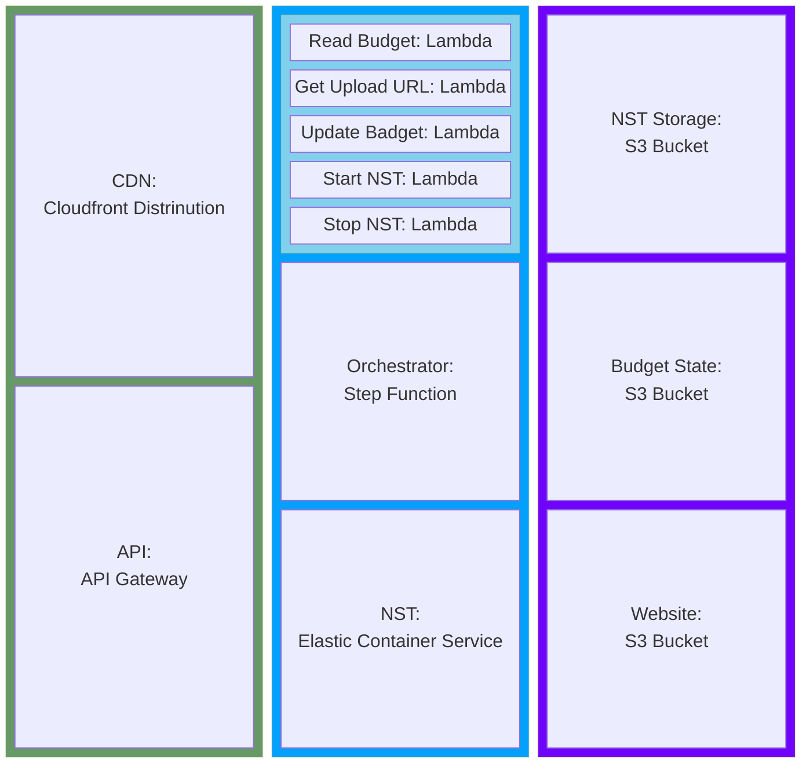
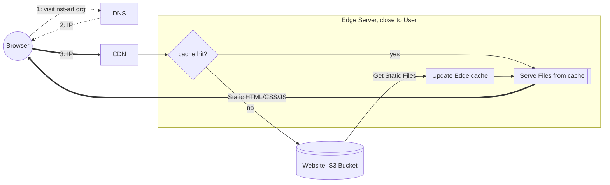
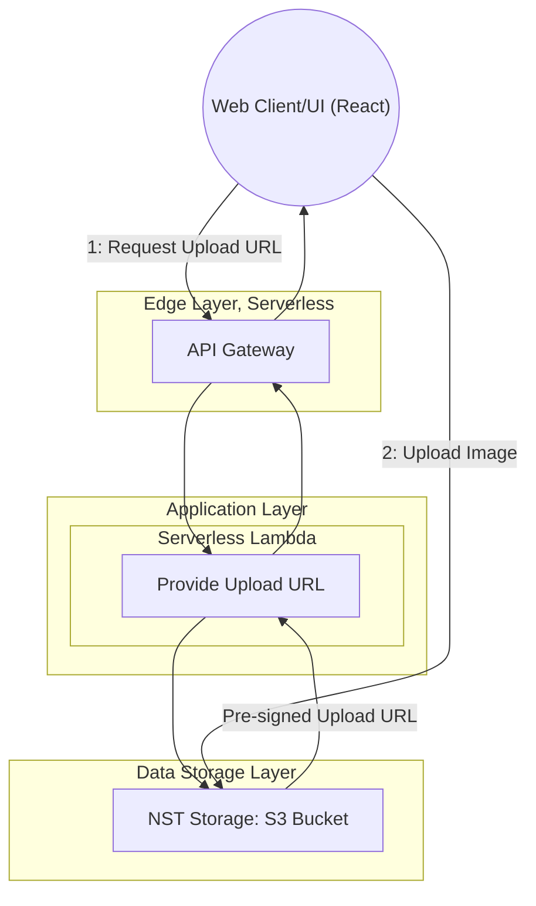
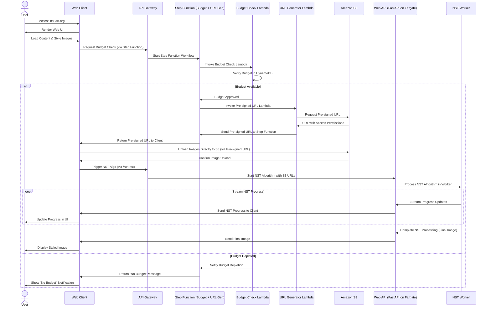
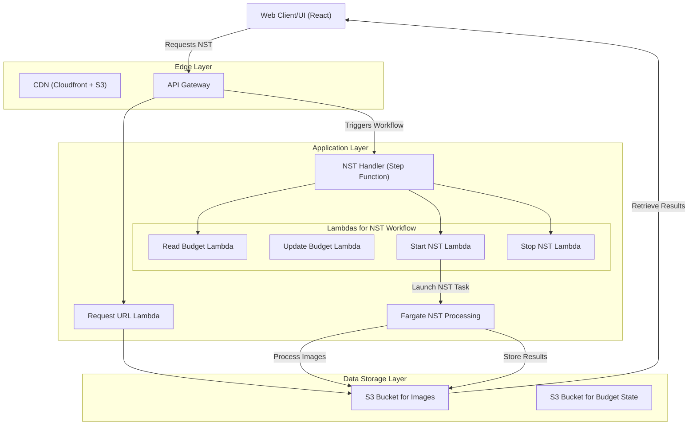

# Neural Style Transfer - System

## High-level Architecture
> Infrastructure overview

This Block Diagram visualizes all the AWS Resources involved in the `NST System` and groups them:

- EDGE: All internet (client) requests, arrive here first
  - **CDN** acting as Edge (File) Server of the Static Website
  - **API** acting as Gateway to Client HTTP requests
- APPLICATION: Serverless Compute
  - **Orchestrator** modeling the App's Logic, with a State Machine, and triggering Lambdas
  - 5 **Lambda Functions**, (aka serverless) for handling events within the system, with auto-scaling
  - **NST Service** (Elastic Container Service) running the NST Algorithm, deployed in AWS Fargate
- STORAGE: Website, App File Storage
  - **NST Storage**, as Bucket in S3, for Images Uploads/Downloads
  - **Website**, as Bucket in S3, for hosting the (SSR) Static website files (HTML/CSS/JS)
  - **NST Badget**, as Bucket in S3, for tracking the remaining badget

> Manage Infra via [terraform/main.tf](./terraform/main.tf)
 

## Actors

- `User`: an anonymous user

## User Flows

### Access Web Client

> Visit nst-art.org in your browser.

### Upload Image

### End to End 

1. User Visits website at nst-art.org and CDN serves static html/js/css site
2. Web UI is rendered in browser
3. User Loads `Content` Image
4. User Loads `Style` Image
5. User Selects `Algorithm parameters`
6. User Clicks the `Run` button

