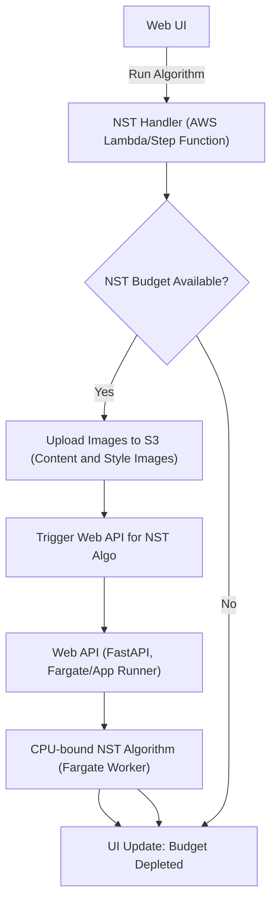
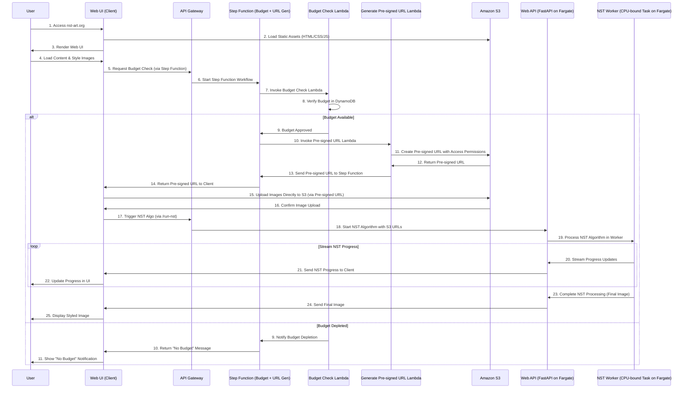

# Neural Style Transfer - System

## Components

- **CDN**, Cloudfront/S3/Route53
- **Web UI** (aka Client), written with `React`, built with `Gatsby`, deployed in S3
- **NST Handler**, possibly deployed in AWS Lambda
  - Able to check if `nst budget` is depleted or not
  - nst budget is a certain quota in AWS to prevent charges from increasing too much
  - assumption is that both AWS Fargate and AWS App Runner provide this functionality
- **Web API**, written with `Python` and `FastAPI`, deployed in AWS Fargate or AWS App Runner
  - **REST** or **RPC**
  - Runs CPU-bound NST algorithm

## Actors

- `User`: an anonymous user

## User flow

1. User Visits website at nst-art.org and CDN serves static html/js/css site
2. Web UI is rendered in browser
3. User Loads `Content` Image
4. User Loads `Style` Image
5. User Selects `Algorithm parameters`
6. User Clicks the `Run` button
   1. A message is dispatched to **NST Handler** and decides
      1. If `nst budget` is not depleted
         2. Then it sends a response to Web UI so `UI update A` should indicate to User that NST algo is triggering
         3. Should call the Web API to actually run the CPU-bound NST Algo
            1. File upload should happen (either from Client or Lambda, not sure yet)
         4. The Web API (or possibly another components?) should be able to stream algo updates to the Client
         5. UI should then be able to update its content on regular step/interval with NST algo updates (ie number of epoch)
   2. If `nst budget` is depleted
      1. Then **NST Handler** sends a response to Web UI, so that `UI update B` should indicate to User that "unfortunately there is no budget"

> If NST was triggered and the algo was started then:

Then we would like ideally to stream an image to the Client too. NST stands for Neural Style Transfer, so we want to stream the so-called `Generated Image`. We can try websockets.

If streaming is not possible or for a quicker PoC we should just "send" the image once, when the algorithm epochs stop.

