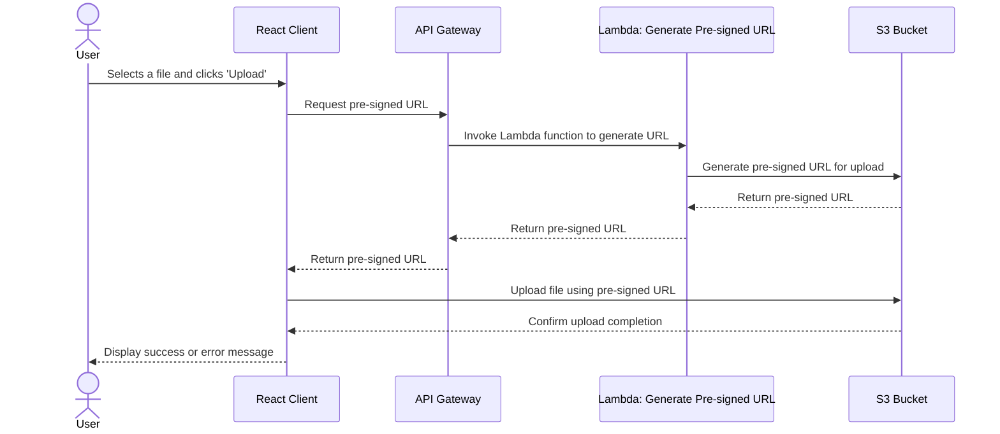
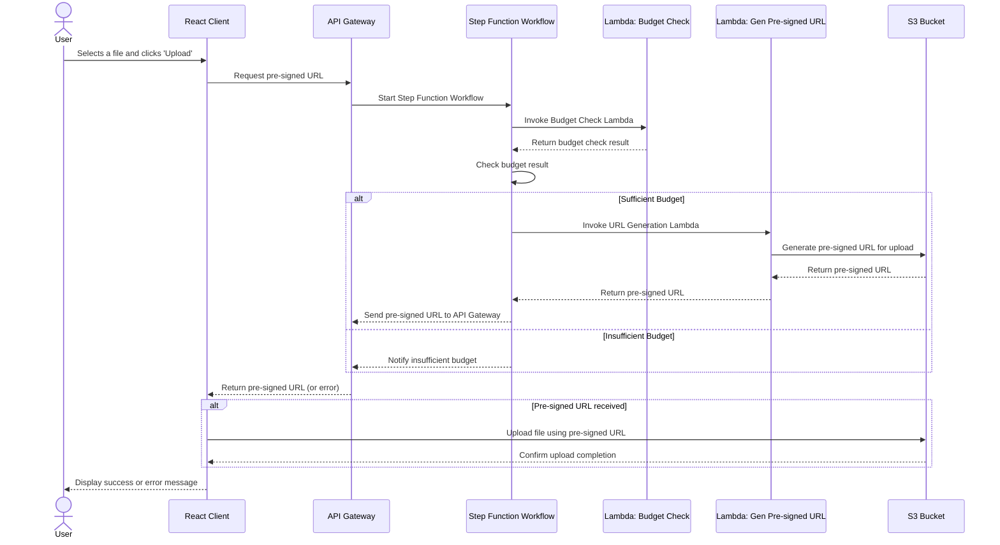

# URL Provider Lambda

> Generate Pre-signed URLs with Access Permissions

This AWS Lambda Function requires minimum dependencies, no complex OS configuration and does not require more than 250MB.  
Thus we deploy as `ZIP`. See https://docs.aws.amazon.com/lambda/latest/dg/python-package.html



## Build Process

> In the context of a ZIP Lambda Deployment building means preparing the ZIP to be Lambda-compatible

**TLDR: Build Deployable** `ZIP file`:
```sh
rm lambda_url_provider/lambda_url_provider.zip
./scripts/build-lambda-zip.sh -r ./lambda_url_provider/ -p python3.11 -h generate_presigned_url.py
```

## How-to: Deploy new version, with `ZIP`
```sh
rm lambda_url_provider/lambda_url_provider.zip

./scripts/build-lambda-zip.sh -r ./lambda_url_provider/ -p python3.11 -h generate_presigned_url.py

cd terraform

# let terraform upload the zip file produced, by state transitioning
terraform plan --var-file env_dev.tfvars --var-file env.tfvars -out tfplan

terraform apply tfplan
```

## How-to: Create a Deployable ZIP

**Root directory** of ZIP is this README's parent [lambda_url_provider/](./) directory.

1. `cd` into the **Root directory**
2. Create and activate a virtual environment
    ```sh
    python3.12 -m virtualenv env
    source ./env/bin/activate
    ```
3. Install your required libraries using pip. The following example installs the `Boto3 SDK`
    ```sh
    pip install boto3
    ```
4. Use pip show to find the location in your virtual environment where pip has installed your dependencies.
    ```
    pip show <package_name>
    ```
5. Deactivate the virtual environment
    ```
    deactivate
    ```
6. Navigate into the directory containing the dependencies you installed with pip and **create a .zip file** in your project directory with the installed dependencies at the root. In this example, pip has installed your dependencies in the env/lib/python3.12/site-packages directory.
    ```
    cd env/lib/python3.12/site-packages
    zip -r ../../../../my_deployment_package.zip .
    ```
7. Navigate to the root of your project directory where the .py file containing your handler code is located and add that file to the root of your **.zip package**. In this example, your function code file is named `lambda_function.py`.
    ```
    cd ../../../../
    zip my_deployment_package.zip lambda_function.py
    ```

## Notes


