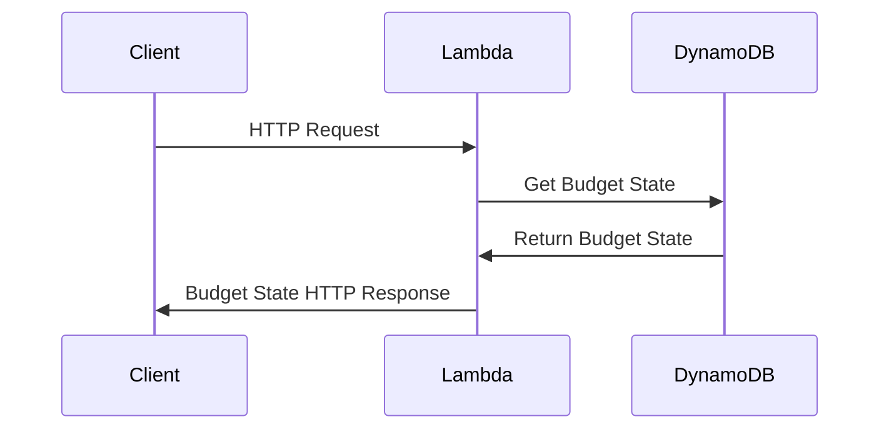

# Budget Checker Lambda

> Check the current state of the Budget

Deployed as `ZIP` in `AWS Lambda`.



## Build Process

**TLDR: Build Deployable** `ZIP file`:
```sh
rm lambda_functions/read_budget_state/read_budget_state.zip
./scripts/build-lambda-zip.sh -r ./lambda_functions/read_budget_state/ -p python3.11 -h read_budget_state.py
```

## How-to: Deploy new version, with `ZIP`
```sh
rm lambda_functions/read_budget_state/read_budget_state.zip

./scripts/build-lambda-zip.sh -r ./lambda_functions/read_budget_state/ -p python3.11 -h read_budget_state.py

cd terraform

# let terraform upload the zip file produced, by state transitioning
terraform plan --var-file env_dev.tfvars -out tfplan

terraform apply tfplan
```
