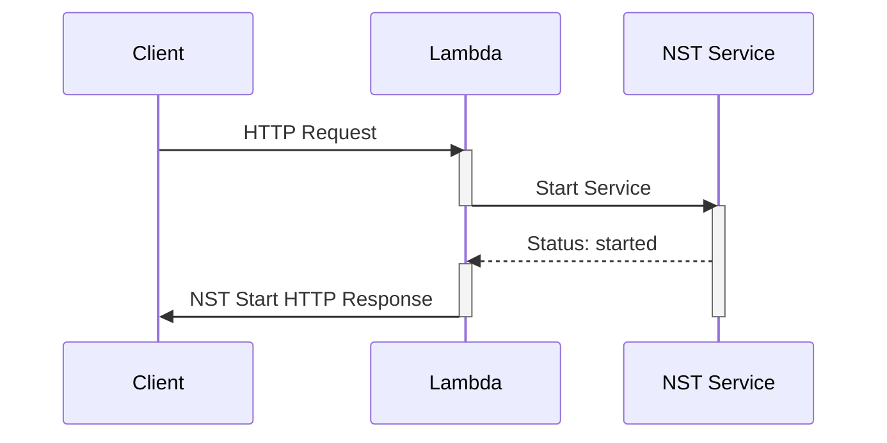

# Start NST Lambda

> Starts the NST Elastic Container Service

Deployed as `ZIP` in `AWS Lambda`.



## Build Process

**TLDR: Build Deployable** `ZIP file`:
```sh
rm lambda_functions/start_nst/start_nst.zip
./scripts/build-lambda-zip.sh -r ./lambda_functions/start_nst/ -p python3.11 -h start_nst.py
```

## How-to: Deploy new version, with `ZIP`
```sh
rm lambda_functions/start_nst/start_nst.zip

./scripts/build-lambda-zip.sh -r ./lambda_functions/start_nst/ -p python3.11 -h start_nst.py

cd terraform

# let terraform upload the zip file produced, by state transitioning
terraform plan --var-file env_dev.tfvars -out tfplan

terraform apply tfplan
```
